# Docker Management Dashboard

A management dashboard for your local docker containers

> This was created during my time as a student at Code Chrysalis

<p align="center">
     
</p> 
<br><br>

## Overview

Docker Management Dashboard is an electron powered desktop application to manage your local docker containers in a friendly and interactive way without having to deal with the docker CLI.

It allows you to do the following operations:

#### Containers:

- Start
- Stop
- Pause
- Unpause
- Remove
- Inspect
- Get Logs

#### Volumes:

- Create
- Search
- Delete
- Prune

## Architecture

Its built using the following technologies:

- Vue JS
- Vuetify
- Node JS
- [Electron](https://electronjs.org/)
- [Docker](https://www.docker.com/)
- [Dockerode](https://github.com/apocas/dockerode.git)

<p align="center">
    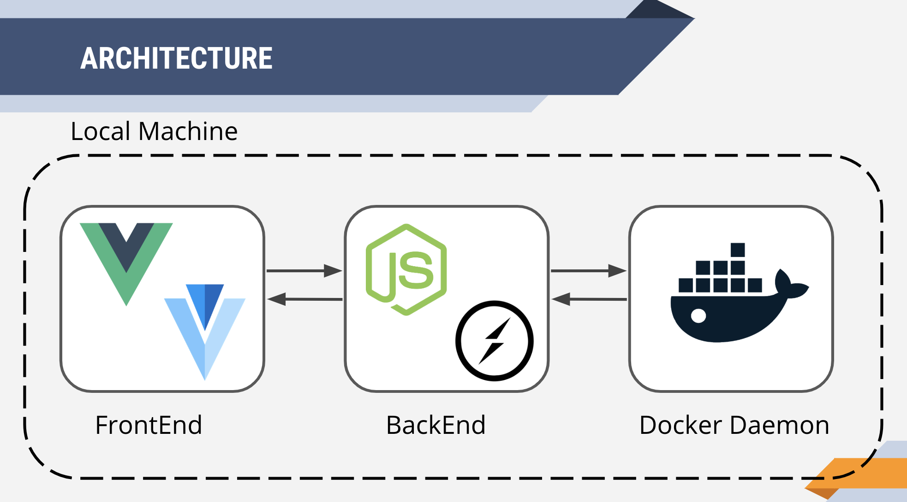
</p>

## SetUp

To install and use head to the [releases](https://github.com/zero4994/docker-management-dashboard/releases) section and download the latest version. Note: The application is only currently available for MacOS.

If you want to build or contribute to this project:

Clone this repostitory

```bash
git clone https://github.com/zero4994/docker-management-dashboard.git
```

Execute yarn to initialize

```bash
yarn install
```

Serve the Application for local development

```bash
yarn serve
```

Build the application for installation

```bash
yarn electron:build
```

The output files can be found on /dist_electron folder

## Use

Once the application is installed the dashboard will launch as a desktop appliation.

<p align="center">
    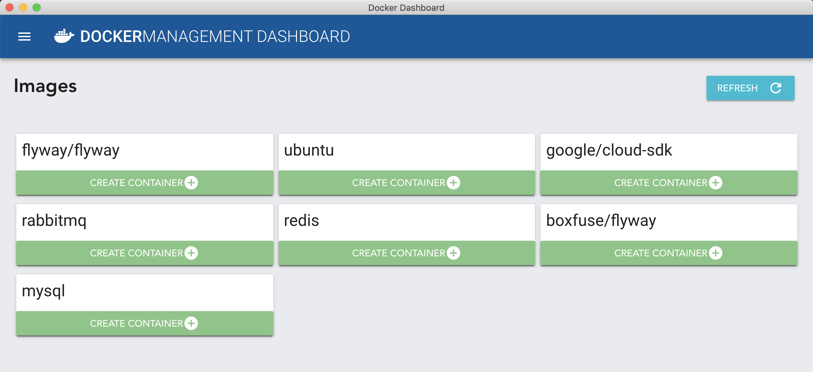 
</p>

### Containers

#### Starting Containers

The image screen can take a JSON Object as an input for the container's initial conditions. The definitions of the properties of the JSON Object can be found [here](https://docs.docker.com/engine/api/v1.37/#operation/ContainerCreate)

<p align="center">
    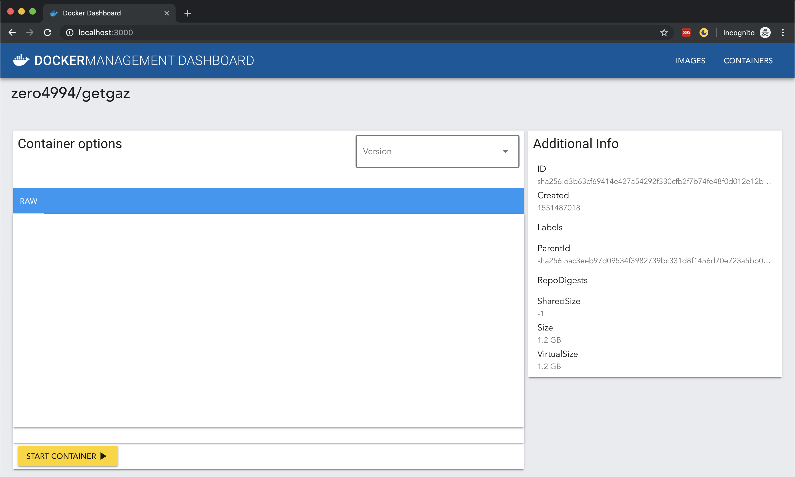 
</p>
<br/>

In case you have more than one tag of a certain repo (ex. Ubuntu 18.04 and Ubuntu 19.10) in your local machine this screen will display all tags for it in the Tags combo box, one has to be selected in order to start a container.

<p align="center">
    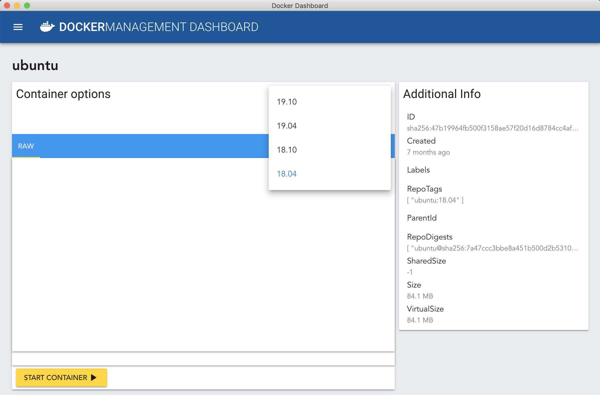 
</p>
<br/>

#### Managing Containers

The Docker Management Dashboard can perform basic operations to container "at glance"

<p align="center">
    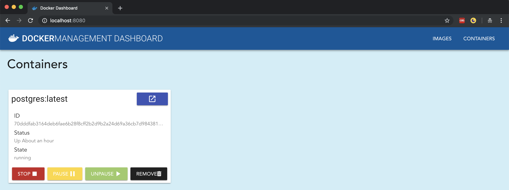 
</p>
<br/>

When a container is expanded the screen will display the logs as default and also quick actions to perform

<p align="center">
    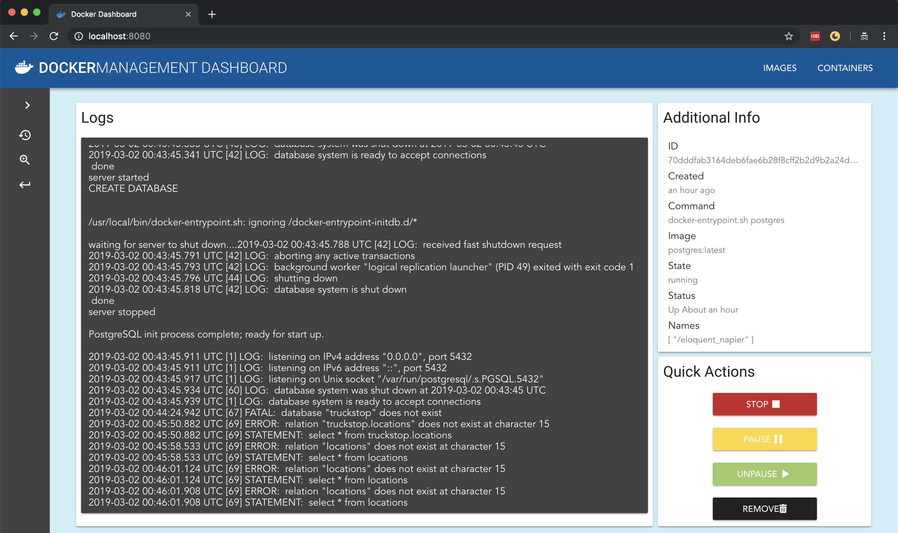 
</p>
<br/>

From the left menu inspection of the container is also available

<p align="center">
    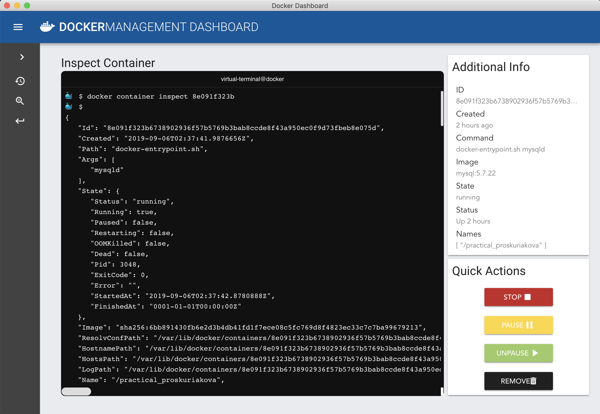 
</p>
<br/>

### Volumes

The volumes screen will display all available volumes in your local machine

<p align="center">
    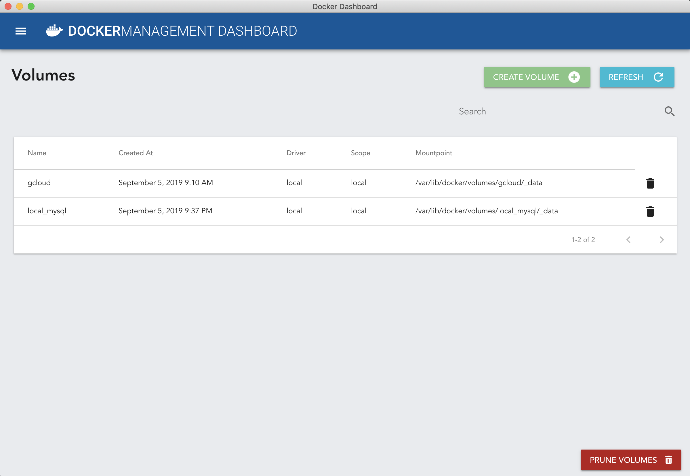 
</p>
<br/>

#### Create Volume

By selecting this option you will be asked for a name for that volume. Names must be in the format

```bash
[a-zA-Z0-9][a-zA-Z0-9_.-]
```

<p align="center">
    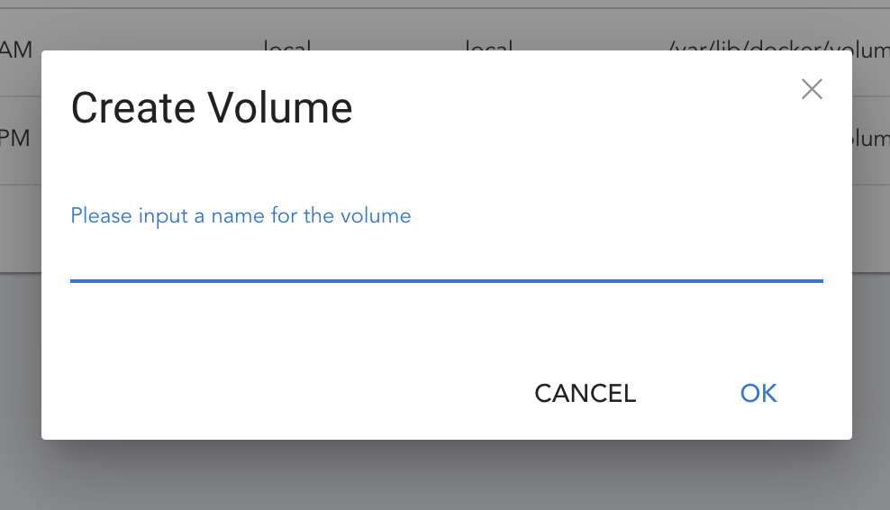 
</p>
<br/>

#### Delete Volume

By selecting the icon at the end of every volume you can delete it from you local machine. You will be prompted for confirmation. Note: You can only remove volumes that are not currently being used by a container.

<p align="center">
    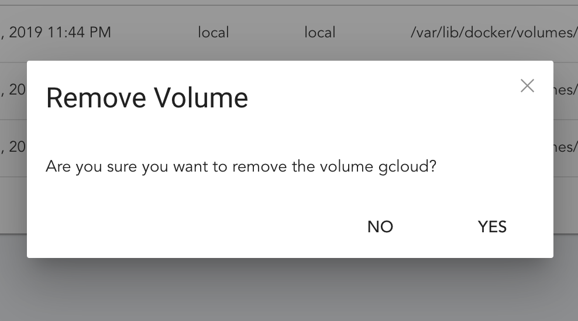 
</p>
<br/>

#### Prune Volumes

By selecting the prune volumes option you can delete all the volumes in your local machine. <strong> Important: </strong> This option will remove all local volumes not used by at least one container.

<p align="center">
    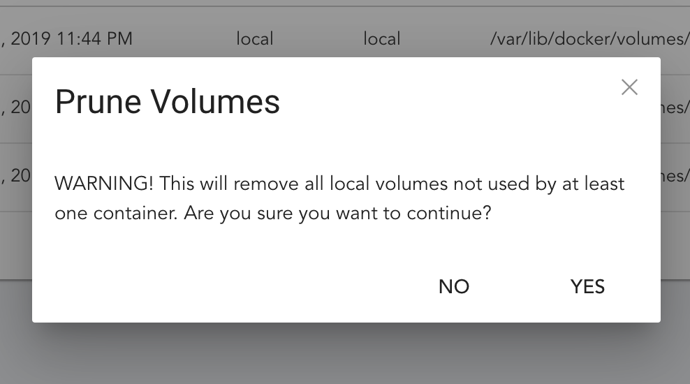 
</p>
<br/>

## Contribution

Feel free to fork and contribute to this project
